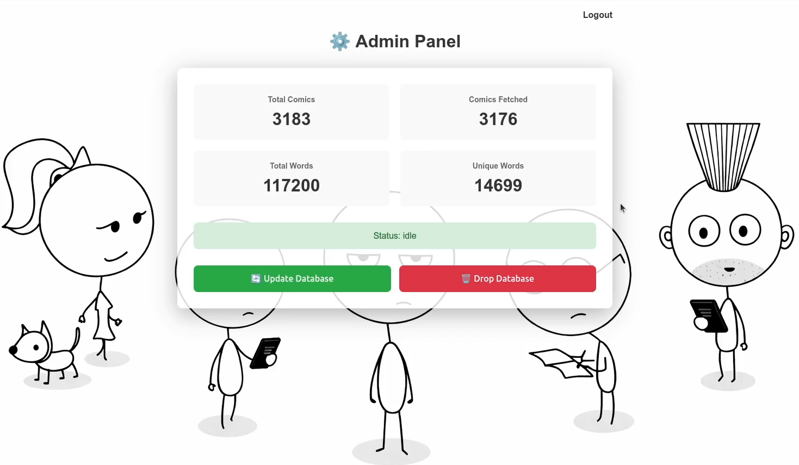

[](https://github.com/alexey0b/xkcd-search-service/actions/workflows/ci.yaml)
[](https://coveralls.io/github/alexey0b/xkcd-search-service?branch=main)

# XKCD Comics Search Service

## Описание проекта

Веб-интерфейс для поискового сервиса комиксов [XKCD](https://xkcd.com/). Проект представляет собой микросервисную архитектуру, предоставляющим пользователям возможность поиска комиксов по ключевым словам через веб-интерфейс.

---

## Возможности

### Для пользователей

- 🔍 **Поиск комиксов** по ключевым словам
- 🖼️ **Просмотр результатов** с превью изображений

### Для администраторов

- 🔐 **JWT-авторизация** с автоматическим редиректом при истечении токена
- 📊 **Статистика** - количество комиксов, слов, индексированных данных
- 🔄 **Обновление БД** - загрузка новых комиксов из XKCD API
- 🗑️ **Очистка БД** - полное удаление данных
- 📈 **Мониторинг статуса** - отслеживание процесса обновления

---

## Быстрый стартa

### Docker Compose

```bash
# Запуск всех сервисов
make up

# Доступ
http://localhost:23000
```

### Kubernetes (Minikube)

```bash
# Инициализация Minikube с CNI
make k8s-init

# Развертывание приложения
make k8s-start

# Port-forward для доступа (в отдельном терминале)
make k8s-port-forward
```

---

## Команды Makefile

### Docker Compose

| Команда             | Описание                       |
| ------------------- | ------------------------------ |
| `make build-images` | Собрать Docker образы          |
| `make up`           | Запустить все сервисы          |
| `make down`         | Остановить сервисы             |
| `make clean`        | Остановить и удалить volumes   |
| `make test`         | Запустить интеграционные тесты |

### Kubernetes

| Команда                 | Описание                        |
| ----------------------- | ------------------------------- |
| `make k8s-init`         | Инициализировать Minikube с CNI |
| `make k8s-start`        | Развернуть приложение в K8s     |
| `make k8s-delete`       | Удалить все ресурсы             |
| `make k8s-restart`      | Пересоздать все ресурсы         |
| `make k8s-port-forward` | Пробросить порт Ingress         |
| `make k8s-dashboard`    | Открыть Kubernetes Dashboard    |
| `make k8s-prometheus-ui`| Открыть Prometheus UI           |
| `make k8s-stop`         | Остановить Minikube             |
| `make k8s-clean`        | Удалить Minikube кластер        |

### Качество кода

| Команда         | Описание              |
| --------------- | --------------------- |
| `make lint`     | Запустить линтеры     |
| `make cover`    | Покрытие кода тестами |
| `make security` | Проверка безопасности |

### Тестирование

| Команда                  | Описание                  |
| ------------------------ | ------------------------- |
| `make unit-tests`        | Запуск unit тестов        |
| `make integration-tests` | Запуск integration тестов |
| `make clean-test`        | Очистить кеш тестов       |

---

## Демонстрация

🎥 

### Скриншоты

- **Авторизация для админа**


- **Админ-панель**



- **Страница поиска**


---

## Архитектура проекта

### Структура проекта

> **Архитектурный паттерн:** Hexagonal Architecture (Ports & Adapters)

```
xkcd-search-service/
├── search-services/              # Микросервисы (Go)
│   ├── frontend/                 # Веб-интерфейс (SSR, JWT, embedded files)
│   ├── api/                      # API Gateway (REST → gRPC)
│   ├── search/                   # Поиск (PostgreSQL, NATS subscriber)
│   ├── update/                   # Обновление (XKCD API, NATS publisher)
│   ├── words/                    # Индексация (стемминг Snowball)
│   └── proto/                    # gRPC Protocol Buffers
├── infrastructure/
│   ├── k8s/                      # Kubernetes манифесты
│   │   ├── namespace.yaml
│   │   ├── configmaps/           # ConfigMaps для сервисов
│   │   ├── deployments/          # Deployments всех сервисов
│   │   └── services/             # Services для доступа к подам
│   └── prometheus/
│       └── prometheus.yaml       # Конфигурация Prometheus для Docker Compose
├── tests/                        # Интеграционные тесты (testcontainers)
├── docs/                         # Документация и скриншоты
├── compose.yaml                  # Docker Compose конфигурация
└── Makefile                      # Автоматизация сборки и развертывания
```

### Микросервисы

- **Frontend** - веб-интерфейс с HTML-шаблонами, JWT-авторизацией, Prometheus метриками
- **API** - API Gateway для маршрутизации REST запросов к gRPC сервисам, Prometheus метрики
- **Search** - сервис полнотекстового поиска с in-memory индексом, NATS subscriber, Prometheus метрики
- **Update** - сервис обновления БД комиксов из XKCD API, NATS publisher, Prometheus метрики
- **Words** - сервис индексации и нормализации слов (стемминг Snowball)
- **PostgreSQL** - реляционное хранилище данных
- **NATS** - брокер сообщений для событийной архитектуры
- **Prometheus** - система мониторинга и сбора метрик

### Технологии

- **Backend**: Go 1.23+
- **Frontend**: HTML, CSS, JavaScript
- **Database**: PostgreSQL 17
- **Message Broker**: NATS 2.12.3
- **Monitoring**: Prometheus 3.8.0
- **Orchestration**: Docker Compose, Kubernetes (Minikube)

**Основные библиотеки:**

- [golang-jwt/jwt](https://github.com/golang-jwt/jwt) - JWT авторизация
- [jackc/pgx](https://github.com/jackc/pgx) - PostgreSQL драйвер и toolkit
- [jmoiron/sqlx](https://github.com/jmoiron/sqlx) - SQL расширения
- [nats-io/nats.go](https://github.com/nats-io/nats.go) - NATS клиент
- [golang-migrate/migrate](https://github.com/golang-migrate/migrate) - миграции БД
- [kljensen/snowball](https://github.com/kljensen/snowball) - стемминг для индексации
- [grpc/grpc-go](https://github.com/grpc/grpc-go) - gRPC фреймворк
- [prometheus/client_golang](https://github.com/prometheus/client_golang) - Prometheus метрики
- [testcontainers-go](https://github.com/testcontainers/testcontainers-go) - интеграционное тестирование
