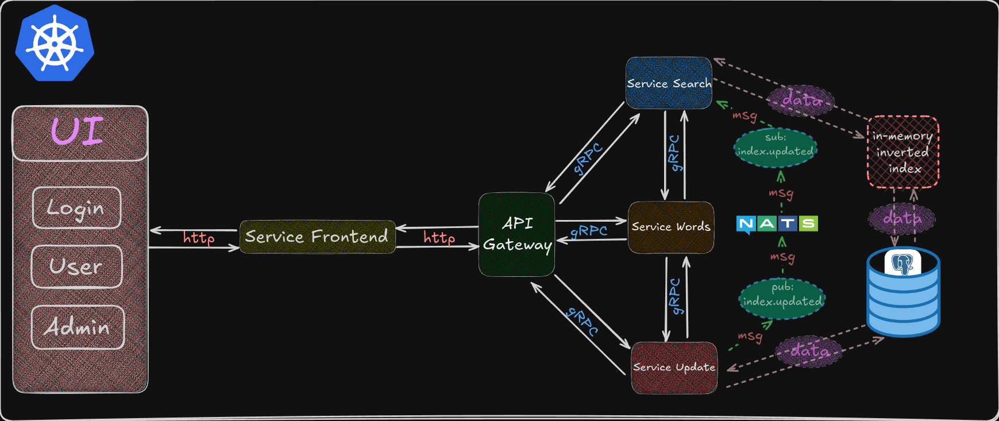

[](https://github.com/alexey0b/xkcd-search-service/actions/workflows/ci.yaml)
[](https://coveralls.io/github/alexey0b/xkcd-search-service)

# XKCD Comics Search Service

## Project Description

Web interface for [XKCD](https://xkcd.com/) comics search service. The project implements a microservices architecture that provides users with the ability to search for comics by keywords through a web interface.

---

## Features

### For Users

- 🔍 **Search comics** by keywords
- 🖼️ **View results** with image previews

---

### For Administrators

- 🔐 **JWT authentication** with automatic redirect on token expiration
- 📊 **Statistics** - number of comics, words, indexed data
- 🔄 **Database update** - fetch new comics from XKCD API
- 🗑️ **Database cleanup** - complete data removal
- 📈 **Status monitoring** - track update process

---

## Quick Start

### Docker Compose

```bash
# Start all services
make up

# Access
http://localhost:23000
```

---

### Kubernetes (Minikube)

```bash
# Initialize Minikube with CNI
make k8s-init

# Deploy application
make k8s-start

# Port-forward for access (in separate terminal)
make k8s-port-forward
```

---

### Testing

| Command                  | Description              |
| ------------------------ | ------------------------ |
| `make unit-tests`        | Run unit tests           |
| `make integration-tests` | Run integration tests    |
| `make clean-test`        | Clean test cache         |

---

## Demo

🎥 

---

## Project Architecture

### Project Structure

> ***Hexagonal Architecture*** (Ports & Adapters)



```
xkcd-search-service/
├── search-services/              # Microservices (Go)
│   ├── frontend/                 # Web interface (SSR, JWT, embedded files)
│   ├── api/                      # API Gateway (REST → gRPC)
│   ├── search/                   # Search service (PostgreSQL, NATS subscriber)
│   ├── update/                   # Update service (XKCD API, NATS publisher)
│   ├── words/                    # Indexing service (Snowball stemming)
│   └── proto/                    # gRPC Protocol Buffers
├── infrastructure/
│   ├── k8s/                      # Kubernetes manifests
│   │   ├── namespace.yaml
│   │   ├── configmaps/           # ConfigMaps for services
│   │   ├── deployments/          # Deployments for all services
│   │   └── services/             # Services for pod access
│   └── prometheus/
│       └── prometheus.yaml       # Prometheus config for Docker Compose
├── tests/                        # Integration tests (testcontainers)
├── docs/                         # Documentation and screenshots
├── compose.yaml                  # Docker Compose configuration
└── Makefile                      # Build and deployment automation
```

---

### Microservices

- **Frontend** - web interface with HTML templates, JWT authentication, Prometheus metrics
- **API** - API Gateway for routing REST requests to gRPC services, Prometheus metrics
- **Search** - full-text search service with in-memory index, NATS subscriber, Prometheus metrics
- **Update** - database update service from XKCD API, NATS publisher, Prometheus metrics
- **Words** - word indexing and normalization service (Snowball stemming)
- **PostgreSQL** - relational data storage
- **NATS** - message broker for event-driven architecture
- **Prometheus** - monitoring and metrics collection system

---

### Technologies

- **Backend**: Go 1.23+
- **Frontend**: HTML, CSS, JavaScript
- **Database**: PostgreSQL 17
- **Message Broker**: NATS 2.12.3
- **Monitoring**: Prometheus 3.8.0
- **Orchestration**: Docker Compose, Kubernetes (Minikube)

---

- [golang-jwt/jwt](https://github.com/golang-jwt/jwt) - JWT authentication
- [jackc/pgx](https://github.com/jackc/pgx) - PostgreSQL driver and toolkit
- [jmoiron/sqlx](https://github.com/jmoiron/sqlx) - SQL extensions
- [nats-io/nats.go](https://github.com/nats-io/nats.go) - NATS client
- [golang-migrate/migrate](https://github.com/golang-migrate/migrate) - database migrations
- [kljensen/snowball](https://github.com/kljensen/snowball) - stemming for indexing
- [grpc/grpc-go](https://github.com/grpc/grpc-go) - gRPC framework
- [prometheus/client_golang](https://github.com/prometheus/client_golang) - Prometheus metrics
- [testcontainers-go](https://github.com/testcontainers/testcontainers-go) - integration testing

---
